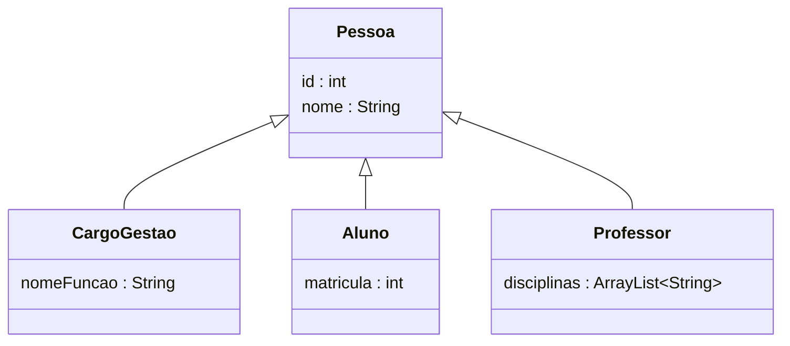
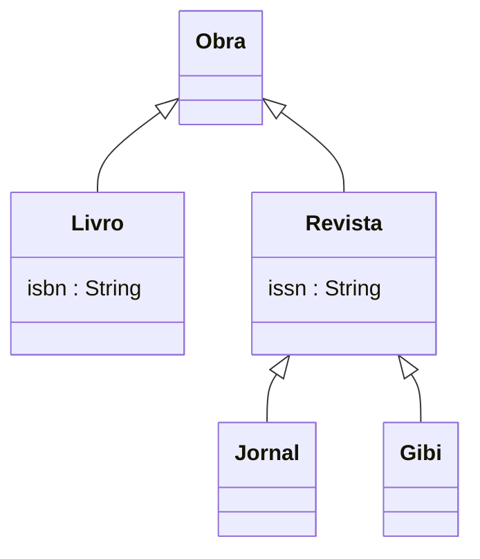
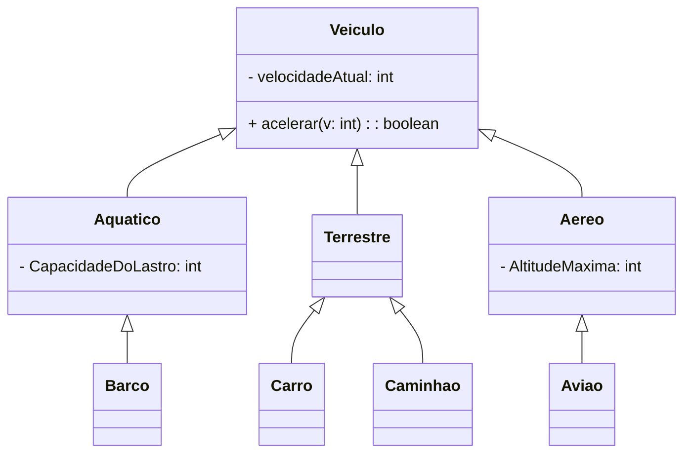
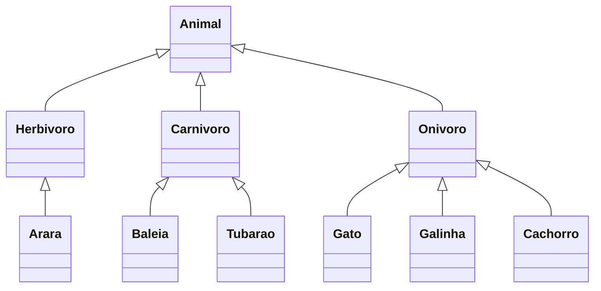

# Herança
> Permite criar classes a partir de classes já existentes
- Use herança quando diferentes classes compartilham caracterísiticas e comportamentos comuns, mas também possuem particularidades.
- Tipos de dados protected podem ser acessados somente para classes no mesmo pacotes

## Corpo docente e discente 

## Livraria e classificações

## Veículos

## Animais 

