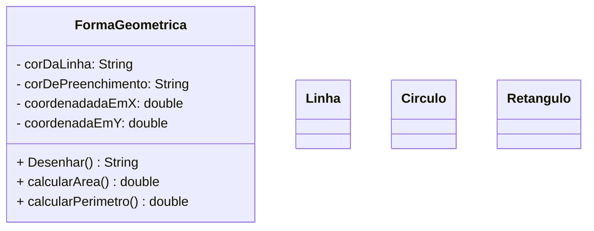

# Aplicativo para desenho vetorial 2D (geometria plana)
- Modele classes para representar as seguintes formas geométricas 2D:
- Linha
- Círculo
- Retângulo
- Cada forma deve ter atributos que a caracterizam, como: cor da linha, cor de preenchimento, coordenadas, raio, etc
- Cada forma deve ter um método desenhar, que retorna uma String com os valores dos atributos do objeto e uma mensagem indicando o tipo da forma
- Formas geométricas que possuem área devem implementar também os métodos calcularArea e calcularPerimetro
- Crie um aplicativo Java (classe com método main) que instancia objetos de cada classe e utiliza seus métodos

## Diagrama UML
