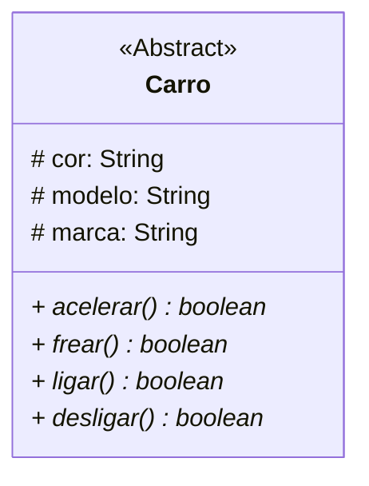

```mermaid
classDiagram
    class Carro {
        <<Abstract>>
        # cor: String
        # modelo: String
        # marca: String
        + acelerar() boolean*
        + frear() boolean*
        + ligar() boolean*
        + desligar() boolean*
    }

```